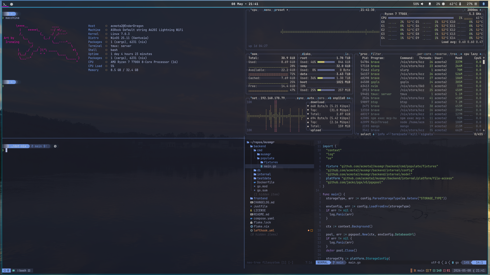

# .nix - NixOS configuration

My flake NixOS configuration - always in expansion.

## Preview

## Machines

| Hostname | Type | Usage | Short description |
| -------- | ---- | ----- | ---- |
| **EnderDragon** | Desktop | Workstation / Gaming | My main machine, used for all sorts of workloads. |
| **Allay** | Laptop | Portable Workstation | My portable machine, used for work on the go. |
| **Wither** | Desktop | Gaming | My console emulation and couch gaming machine. |

## Home-manager

This configuration is automatically enabled for all machines.

A standalone configuration is also available for use on non-NixOS systems.

## Applications in use

### Desktop

- [foot](./desktop/foot/default.nix)
- [mango](./desktop/tiling/mangowc/default.nix)
- [mako](./desktop/tiling/mako/default.nix)
- [waybar](./desktop/tiling/waybar/default.nix)

### Development

- [nixvim](http://github.com/acmota2/dot-nix-neovim) (moved to another repository)
- [tmux](./tmux/default.nix)

### System

- [ly](./display-manager/ly/default.nix)
- [pipewire](./hardware/sound.nix)

### Utils

- [bash](./shell/bash.nix)
- [btop](./btop/default.nix)
- [macchina](./macchina/default.nix)
- [starship](./starship/default.nix)
